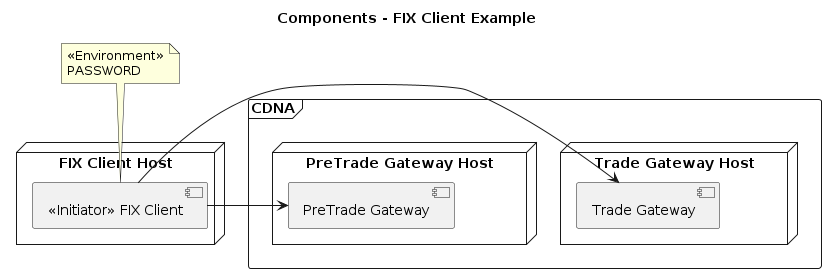

# simple-examples-spring3

## Introduction

Theses are simple examples of a FIX applications using Spring Boot 3. They are based on opensource examples from
[quickfixj-spring-boot-starter-examples](https://github.com/esanchezros/quickfixj-spring-boot-starter-examples) authored by [Eduardo Sanchez-Ros](https://github.com/esanchezros)

The intention was to alter the original example code only a little so that it can be readily compared.

The dependencies on the "official" [QuickFIX/J](https://github.com/quickfix-j/quickfixj) distribution are replaced by a [custom build](https://github.com/NadexWeb/quickfixj-fce) of QuickFIX/J.

Using the custom build for production purposes is optional. To see how to use the original [QuickFIX/J](https://github.com/quickfix-j/quickfixj), 
please refer to the [original examples](https://github.com/esanchezros/quickfixj-spring-boot-starter-examples).

The examples include an example client and an example server so that you don't need to be able to connect to CDNA systems to run the client.

## How to

## Prerequisites

A [Java Development Kit](https://openjdk.org/projects/jdk/) and the [Apache Maven](https://maven.apache.org/) build tool are required. Consider using [sdkman](https://sdkman.io/) to install and manage local development environments. [[ref](https://medium.com/@brunoborges/manage-multiple-jdks-on-mac-os-linux-and-windows-wsl2-3a73467b685c)]

This project depends on the [custom build](https://github.com/NadexWeb/quickfixj-fce) of QuickFIX/J. 
You will need to check out [branch 3.6.0](https://github.com/NadexWeb/quickfixj-fce/tree/3.6.0) of the project and build it as described in [readme-nadex.md](https://github.com/NadexWeb/quickfixj-fce/blob/3.6.0/readme-nadex.md).

This will install the SNAPSHOT version of the project your local maven repository. We cannot yet publish the artefact to Maven Central so this step is necessary. 
It takes some time to build the QuickFIX/J project.

## Build this project

`mvn clean install`

## Run the examples

### Specify custom Spring configuration file location

One can update the `application.yml` in the project and build the project or \
add `--spring.config.location=<path to Spring configuraion>` to the command, for example: 

`java -jar target/simple-client-spring-3.jar --spring.config.location=../../application.yml`

### Example Server
This is a very incomplete example of a Pre Trade FIX gateway that returns a Security List  

`cd simple-server-spring-3 && java -jar target/simple-server-spring-3.jar` or 

`cd simple-server-spring-3 && mvn spring-boot:run`

### Example Client
This is an example of a PreTrade client application. 
It demonstrates :
* SecurityListRequest
* SecurityStatus
* TradingSessionStatus
* MarketDataRequest
* MarketDataSnapshot
* MarketDataIncrementalRefresh

`cd simple-client-spring-3 && java -jar target/simple-client-spring-3.jar` or 

`cd simple-client-spring-3 && mvn spring-boot:run`

### Example Trade Client
This is an example of a Trade client application. It demonstrates:
* NewOrderSingle
* OrderCancelReplaceRequest
* OrderCancelRequest
* PositionReport

`cd simple-trade-client-spring-3 && java -jar target/simple-trade-client-spring-3-spring-3.jar` or

`cd simple-trade-client-spring-3 && mvn spring-boot:run`

## Connect the example client to CDNA environments

Update the QuickFIX/J configuration options in the `application.yml` file using the details provided by CDNA and run the client as above.



# UI Development
For easier UI work, add the following line to your application.yaml:

``` 
spring:
  web:
    resources:
      static-locations[0]: "file:src/main/resources/static/"
```

This will allow you to refetch the static content (html, css, js) on browser reload, rather than needing to run a maven build to see changes.
